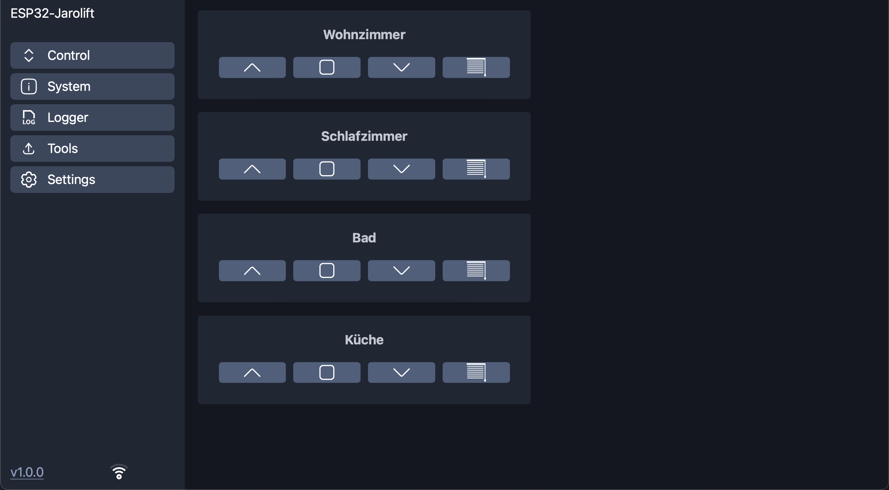
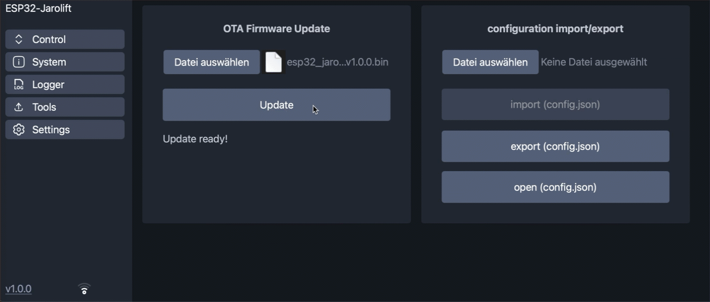
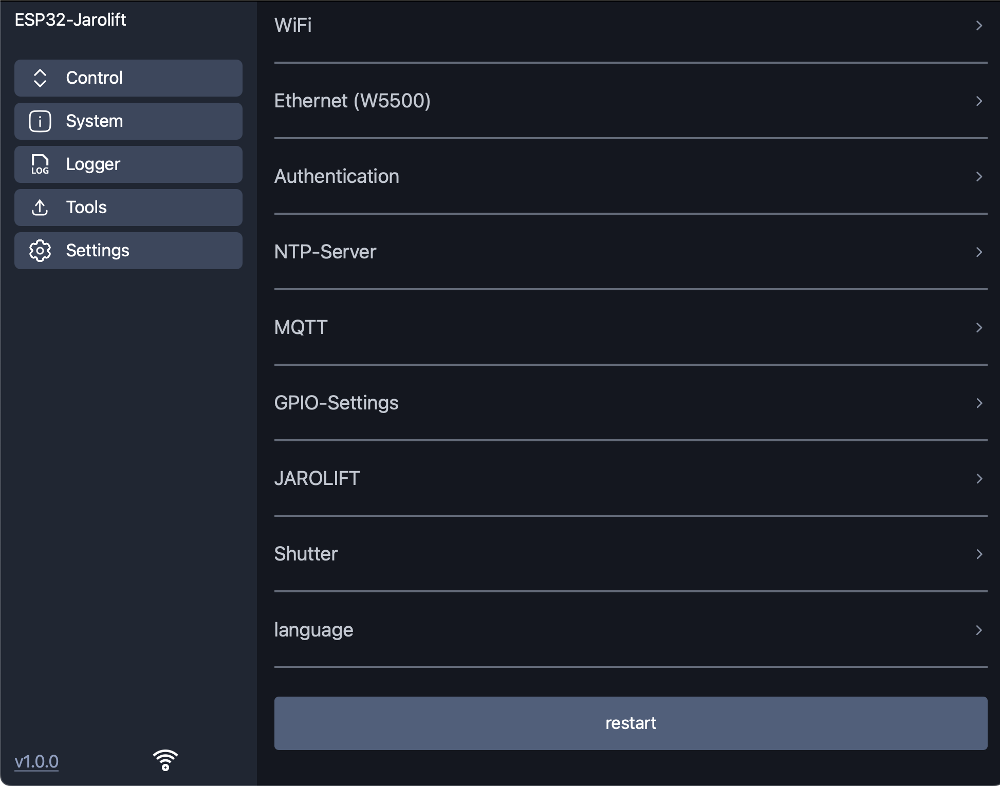
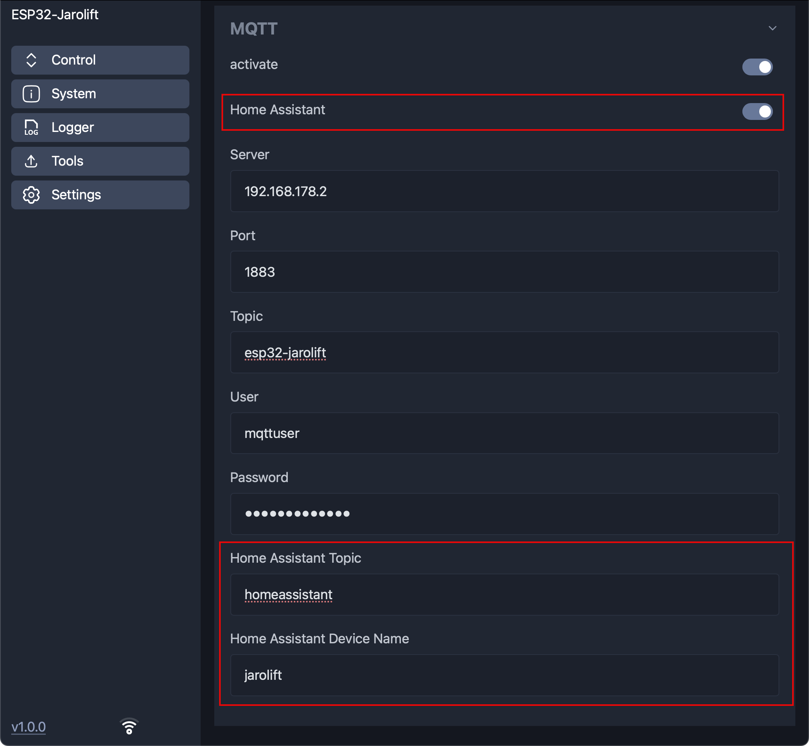
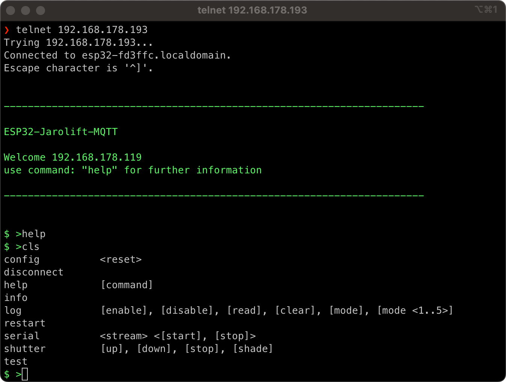

<div align="center">
 

<h3 style="text-align: center;">ESP32-Jarolift-Controller</h3>
</div>


-----

<div align="center">

[](https://github.com/dewenni/ESP32-Jarolift-Controller/releases/latest)


[](https://github.com/dewenni/ESP32-Jarolift-Controller/stargazers/)

</div>

-----

<div align="center">
If you like this project, feel free to push the <b>[Star ⭐️]</b> button and click <b>[Watch 👁]</b> to stay updated.
<br><br>
And if you'd like to support my work, you can also<p>

[](https://github.com/sponsors/dewenni)


</div>

-----

# ESP32-Jarolift-Controller

Controlling Jarolift(TM) TDEF 433MHz radio shutters via **ESP32** and **CC1101** Transceiver Module in asynchronous mode.

## Features

- Web-based User Interface (WebUI):  
A modern, mobile-friendly interface for easy configuration and control.

- MQTT Support:  
Communication and control of devices are handled via MQTT, a lightweight and reliable messaging protocol.

- HomeAssistant Integration:  
Automatic device discovery in HomeAssistant through MQTT Auto Discovery for seamless integration.

- Support for up to 16 Roller Shutters:  
Control up to 16 roller shutters with ease, all managed through the WebUI and MQTT.


Experimental version.
Use at your own risk. For private/educational use only. (Keeloq algorithm licensed only to TI Microcontrollers)
This project is not affiliated in any way with the vendor of the Jarolift components.
Jarolift is a Trademark of Schöneberger Rolladenfabrik GmbH & Co. KG

This version is for an ESP32 and is based on ideas and code from [madmartin/Jarolift_MQTT](https://github.com/madmartin/Jarolift_MQTT).


### Project Homepage, Forum and Author

The original control code was written from Steffen Hille in Nov, 2017

The project home is here: [Project Home](http://www.bastelbudenbuben.de/2017/04/25/protokollanalyse-von-jarolift-tdef-motoren/)

-----



(Desktop Version)

The WebUI is responsive and also offers a mobile layout.

 
 

(Mobile Version)

-----

# Table of Contents

- [Overview](#overview)
- [Hardware](#hardware)
  - [ESP32 + CC1101](#esp32-+-cc1101)
  - [Optional: Ethernet Module W5500](#optional-ethernet-module-w5500)
- [Getting started](#getting-started)
  - [Platform-IO](#platform-io)
  - [ESP-Flash-Tool](#esp-flash-tool)
  - [OTA-Updates](#ota-updates)
  - [Setup-Mode](#setup-mode)
  - [Configuration](#configuration)
  - [Filemanager](#filemanager)
- [MQTT](#mqtt)
  - [Commands](#commands)
  - [Home Assistant](#home-assistant)
- [Optional Communication](#optional-communication)
  - [WebUI-Logger](#webui-logger)
  - [Telnet](#telnet)

-----

# Hardware

## ESP32 + CC1101

a standard SPI GPIO configuration is:

| Signal| GPIO |
|-------|------|
| GD0   | 21   |
| GD2   | 22   |
| CLK   | 18   |
| MOSI  | 23   |
| MISO  | 19   |
| CS    | 5    |

## Optional: Ethernet Module W5500

It is also possible to connect a W5500 Ethernet module to the Board or a generic ESP32.  

> [!IMPORTANT]
> The connection cable should be as short as possible (approx 10cm)

Example for generic ESP32-Mini (Standard SPI port is used by CC1101)

| Signal| GPIO |
|-------|------|
| CLK   | 25   |
| MOSI  | 26   |
| MISO  | 27   |
| CS    | 32   |
| INT   | 33   |
| RST   | 17   |

-----

# Getting started

## Platform-IO

The software is created with [Visual Studio Code](https://code.visualstudio.com) and the [PlatformIO-Plugin](https://platformio.org).  
After installing the software you can clone the project from GitHub or you can download it as zip and open it in PlatformIO.
Then adapt the `upload_port` and corresponding settings in `platformio.ini` to your USB-to-serial Adapter and upload the code to the ESP.

> [!NOTE]
> Python must also be installed in order to fully compile the project. The scripts folder contains, for instance, scripts for creating the web pages that are called when the project is compiled.

## ESP-Flash-Tool

In the releases, you can find also the binary of the Software. If you don´t want to use PlatformIO, you can also use the `esp32_jarolift_controller_flash_vx.x.x.bin` file and flash it directly on the ESP. This bin-file is already a merge with bootloader.bin, partitions.bin and the application.bin. You can flash this image an the ESP at address 0x00.  

**Windows**  
There are several tools available to flash binaries to the ESP.  
One of them is [espressif-flash-download-tool](https://www.espressif.com/en/support/download/other-tools)

**macOS/Linux**  
for Mac it is hard to find a tool with a graphical UI, but you can simple use the esptool.py:

1. open Terminal
2. install esptool: `pip install esptool`  
3. optional get the install path: `which esptool.py`  
4. set path: `export PATH="$PATH:/<path>/esptool.py"` (<- change <path> with result from 3.)
5. goto path where the bin file is located
6. get Device String: `ls /dev/tty* | grep usb` (use this in next Step for <UPLOAD-PORT>)
7. upload: `esptool.py -p <UPLOAD-PORT> write_flash 0x00 esp32_jarolift_controller_flash_vx.x.x.bin`  

## OTA-Updates

since software version 3.0, you can also update the software with the new Elegant OTA web upload.  
You can find the update function in the "Tools" Tab of the WebUI.

here you can choose "Firmware" and select the `esp32_jarolift_controller_ota_update_vx.x.x.bin` file from the release section



But it is also possible to download the software wireless with platformio.
You only have to change the `upload_port` settings in `platformio.ini`

There are two predefined Options:

- OPTION 1: direct cable upload
- OPTION 2: wireless OTA Update

## Setup Mode

There is a "Setup Mode" available. The "Setup Mode" is activated, when you press the "reset-button" of the ESP two times within 3 Seconds.
The "Setup Mode" will also activated if there is no wifi connection configured.

If the ESP goes into "Setup Mode", it will automatically create a own network access point with ssid  
📶 `"ESP32_Jarolift"`  
After you are connected to this network, you can open the webUI on ip-address  
**"http://192.168.4.1"**

## Configuration

Here you can setup all the configuration that fits to your heating system and your infrastructure.

- **WiFi**  
enter your WiFi credentials to connect the ESP to your network

- **Ethernet W5500**  
use Ethernet connection based on W5500 to connect the ESP to your network

- **Authentication**  
you can activate the authentication feature and configure user and password.

- **NTP Server**  
the ESP can connect to a NTP server to get the right Time information.
The default Time-Zone should fit if you are located in germany. Otherwise you can change it manually

- **MQTT**  
here you can activate the MQTT communication and enter mandatory parameters
All the parameters are mandatory!

- **GPIO**  
Here you can configure the GPIO to connect the CC1101 to the ESP32

- **Jarolift**  
here you have to configure some Jarolift specific protocol settings

- **Language**  
There are two languages available. Choose what you prefer.
The language take effect on the webUI and also on the mqtt messages!

> [!NOTE]
> All settings are automatically saved when changes are made

> [!IMPORTANT]
> Changes to GPIO or Jarolift settings require a restart!




## Filemanager

there is also a builtin file manager to open (show), download (export) and upload (import) the configuration file.
The configuration is stored in the ```config.json``` file. To backup and restore the configuration you can download and upload this file.


-----

# MQTT

### additional information's (read only)

status information about WiFi:

```text
Topic: ESP32-Jarolift-Controller/wifi = {  
    "status":"online",  
    "rssi":"-50",  
    "signal":"90",  
    "ip":"192.168.1.1",  
    "date-time":"01.01.2022 - 10:20:30"  
}
```

## Commands

To control the shutters yu can use the following mqtt commands.
{UP, OPEN, 0} means, that you can use one of the listed payload commands.

```text
command:    restart ESP
topic:      ../cmd/restart
payload:    none

command:    shutter up
topic:      ../cmd/shutter/1 ... cmd/shutter/16
payload:    {UP, OPEN, 0}

command:    shutter down
topic:      ../cmd/shutter/1 ... cmd/shutter/16
payload:    {DOWN, CLOSE, 1}

command:    shutter stop
topic:      ../cmd/shutter/1 ... cmd/shutter/16
payload:    {STOP, 2}

command:    shutter shade
topic:      ../cmd/shutter/1 ... cmd/shutter/16
payload:    {SHADE, 3}

```

## Home Assistant

MQTT discovery for Home Assistant makes it easy to get all values in Home Assistant.
The configured shutters will automatically visible as mqtt device in Home Assistant if HomeAssistant is enabled.

see also the official documentation: https://www.home-assistant.io/integrations/mqtt/#discovery-messages

 

In the mqtt settings you can activate the discovery function and also set the mqtt discovery topic and the device name for Home Assistant  


-----

# Optional Communication

in addition to mqtt there are more communication options.


## WebUI-Logger

There is also a log function with which you can record various messages depending on the filter and display them via the WebUI. This can be useful for your own debugging and also for the further development of the software.


## Telnet

In addition to the WebUI and MQTT, there is also a Telnet interface to communicate with the ESP.
The interface offers several commands to read out information and send commands.
An overview of the commands can be called up using the "help" command.
To connect, a simple Telnet connection can be started via the corresponding IP address of the ESP.

Example: 
```
> telnet 192.168.178.193
```


